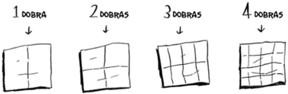

### Complexidade Computacional e Notação Big O

A **complexidade computacional** é uma área da ciência da computação que estuda como os algoritmos se comportam em termos de consumo de recursos, como tempo de execução e espaço de memória. Para avaliar essa eficiência, a notação Big O é amplamente utilizada, pois descreve como o número de operações necessárias para executar um algoritmo cresce em relação ao tamanho da entrada (\( n \)).

Essa análise permite prever a eficiência de um algoritmo, identificar gargalos e escolher a abordagem mais adequada para resolver problemas. A seguir, abordaremos exemplos e conceitos que destacam a importância de entender as taxas de crescimento dos algoritmos.

### 1. Complexidade de Tempo

A complexidade de tempo mede a quantidade de tempo que um algoritmo leva para ser executado conforme o tamanho da entrada aumenta. Essa métrica é expressa em termos assintóticos utilizando a notação Big O, que descreve o comportamento no pior caso.

#### Categorias Comuns de Complexidade de Tempo:

- **O(1) - Constante:**  
  O tempo de execução não varia com o tamanho da entrada.  
  **Exemplo:** Acesso a um elemento específico em um array.

- **O(log n) - Logarítmica:**  
  O tempo cresce de forma logarítmica em relação ao tamanho da entrada.  
  **Exemplo:** Busca binária.

- **O(n) - Linear:**  
  O tempo cresce proporcionalmente ao tamanho da entrada.  
  **Exemplo:** Percorrer todos os elementos de um array (busca linear).

- **O(n log n) - Log-linear:**  
  O tempo é proporcional ao produto do tamanho da entrada e do logaritmo desse tamanho.  
  **Exemplo:** Algoritmos de ordenação eficientes como mergesort e quicksort.

- **O(n²) - Quadrática:**  
  O tempo cresce proporcionalmente ao quadrado do tamanho da entrada.  
  **Exemplo:** Ordenações simples como bubble sort.

- **O(2ⁿ) - Exponencial:**  
  O tempo de execução cresce exponencialmente com o aumento da entrada.  
  **Exemplo:** Resolver problemas como o da Torre de Hanói.

- **O(n!) - Fatorial:**  
  Usado em problemas combinatórios, onde o número de possibilidades cresce muito rapidamente.  
  **Exemplo:** Problema do Caixeiro Viajante (algoritmo de força bruta).

### 2. Complexidade de Espaço

A complexidade de espaço avalia a quantidade de memória necessária para executar um algoritmo. Ela considera:

- **Espaço fixo:** Memória usada para armazenar variáveis e estruturas fixas, independente do tamanho da entrada.
- **Espaço dependente:** Memória usada que varia com o tamanho da entrada (por exemplo, arrays ou tabelas dinâmicas).

#### Exemplos de Complexidade de Espaço:

- **O(1) - Constante:**  
  O espaço usado não aumenta com o tamanho da entrada.  
  **Exemplo:** Algoritmos como o selection sort.

- **O(n) - Linear:**  
  O espaço usado cresce proporcionalmente ao tamanho da entrada.  
  **Exemplo:** Usar arrays para armazenar resultados intermediários.

- **O(n²) - Quadrática:**  
  O espaço necessário aumenta proporcionalmente ao quadrado do tamanho da entrada.  
  **Exemplo:** Uso de matrizes em algoritmos de programação dinâmica.

### 3. Notação Big O

A notação Big O descreve o comportamento assintótico de funções quando o tamanho da entrada tende ao infinito. Ela é amplamente usada para expressar tanto a complexidade de tempo quanto a de espaço.

**Exemplo:** Um algoritmo que realiza \( n \) operações em um loop e, dentro dele, executa um processo de \( \log(n) \) passos possui complexidade \( O(n \log n) \).

### Importância da Complexidade Computacional

A análise da complexidade computacional é essencial para:

- **Comparação de Algoritmos:** Permite identificar a solução mais eficiente.
- **Escalabilidade:** Garante que o programa funcione bem com grandes volumes de dados.
- **Otimização:** Ajuda a escolher estruturas de dados e estratégias adequadas.

### Escolha de Algoritmos na Prática

A escolha do algoritmo ideal vai além da análise de complexidade. Outros fatores incluem:

- **Tamanho da Entrada:** Para entradas pequenas, algoritmos simples como bubble sort podem ser suficientes. Para entradas maiores, algoritmos mais eficientes são necessários.
- **Recursos Computacionais Disponíveis:** O algoritmo deve considerar as limitações de processamento e memória do sistema.
- **Requisitos de Tempo Real:** Aplicações que exigem respostas rápidas preferem algoritmos de menor complexidade de tempo.
- **Facilidade de Implementação:** Algoritmos eficientes podem ser mais complexos. Soluções menos eficientes, mas mais simples, podem ser preferidas dependendo do contexto.

### Entendendo Taxas de Crescimento: Pesquisa Simples vs. Pesquisa Binária

Considere dois algoritmos usados para buscar elementos em uma lista: **pesquisa simples** (ou linear) e **pesquisa binária**. Esses exemplos ajudam a entender como o tempo de execução varia com o aumento do tamanho da entrada.

#### Pesquisa Simples:

- **Como funciona**: Verifica cada elemento da lista, um por um, até encontrar o desejado ou chegar ao final da lista.
- **Tempo de execução**: O número de operações cresce linearmente com o tamanho da lista (\( O(n) \)).
- **Exemplo**: Para uma lista com 100 elementos, o algoritmo verifica cada um individualmente. Se levar 1 milissegundo por elemento, o tempo total será:
  \[
  100 \times 1 \, \text{ms} = 100 \, \text{ms}.
  \]
  Para 1 bilhão de elementos, o tempo será:
  \[
  1.000.000.000 \times 1 \, \text{ms} = 1.000.000.000 \, \text{ms} \, (\text{ou aproximadamente 11 dias}).
  \]

#### Pesquisa Binária:

- **Como funciona**: Divide a lista ao meio a cada passo, reduzindo pela metade o espaço de busca.
- **Tempo de execução**: O número de operações cresce logaritmicamente em relação ao tamanho da lista (\( O(\log n) \)).
- **Exemplo**: Para uma lista com 100 elementos, o número de verificações necessárias é:
  \[
  \log_2(100) \approx 7.
  \]
  Se cada verificação leva 1 ms, o tempo total será:
  \[
  7 \times 1 \, \text{ms} = 7 \, \text{ms}.
  \]
  Para 1 bilhão de elementos, serão necessárias \( \log_2(1.000.000.000) \approx 30 \) verificações:
  \[
  30 \times 1 \, \text{ms} = 30 \, \text{ms}.
  \]

Esses exemplos mostram como o tempo de execução cresce a taxas distintas. Enquanto a pesquisa simples cresce linearmente, a pesquisa binária aumenta de forma muito mais eficiente, tornando-se milhões de vezes mais rápida em listas maiores.

### Desenhando uma Grade: Comparando Abordagens

Outro exemplo de complexidade computacional é o desenho de uma grade com 16 divisões, onde diferentes abordagens apresentam diferentes taxas de crescimento:

1. **Abordagem Simples**:

   - Cada linha e coluna é desenhada separadamente, uma por vez.
   - Para \( n \) divisões, são necessárias \( 2n \) operações.
   - **Complexidade**: \( O(n) \).

   

     
   

2. **Abordagem Aninhada**:

   - Linhas e colunas são geradas em pares, criando todas as interseções diretamente.
   - Para \( n \) divisões, são necessárias \( n \times n \) operações (ou seja, \( n^2 \)).
   - **Complexidade**: \( O(n^2) \).

   

     
   

Com esse exemplo, fica claro que abordagens aparentemente simples podem se tornar menos eficientes à medida que o tamanho do problema aumenta. Por exemplo, ao passar de uma grade de 16 divisões para 1.000 divisões, a abordagem \( O(n) \) será muito mais vantajosa em termos de desempenho.

### A Importância da Notação Big O

A **notação Big O** fornece uma visão clara de como o desempenho de um algoritmo escala com o tamanho da entrada. Essa análise é crucial porque, na prática, a eficiência não depende apenas de tempos de execução iniciais, mas do comportamento à medida que os dados aumentam.

Por exemplo:

- A **pesquisa simples** (\( O(n) \)) é adequada para listas pequenas, mas rapidamente se torna inviável com entradas grandes.
- A **pesquisa binária** (\( O(\log n) \)), apesar de mais complexa de implementar, é extremamente eficiente para listas grandes, com crescimento exponencialmente mais lento no número de operações necessárias.

### Conclusão

Entender a **complexidade computacional** e como os algoritmos se comportam em diferentes cenários é essencial para escolher a abordagem correta para resolver problemas. A notação Big O é uma ferramenta poderosa para avaliar o crescimento dos tempos de execução, comparando algoritmos e garantindo que soluções sejam escaláveis e eficientes. Seja para buscar um elemento em uma lista ou desenhar grades, a análise cuidadosa do comportamento dos algoritmos ajuda a evitar erros e escolher soluções otimizadas.
