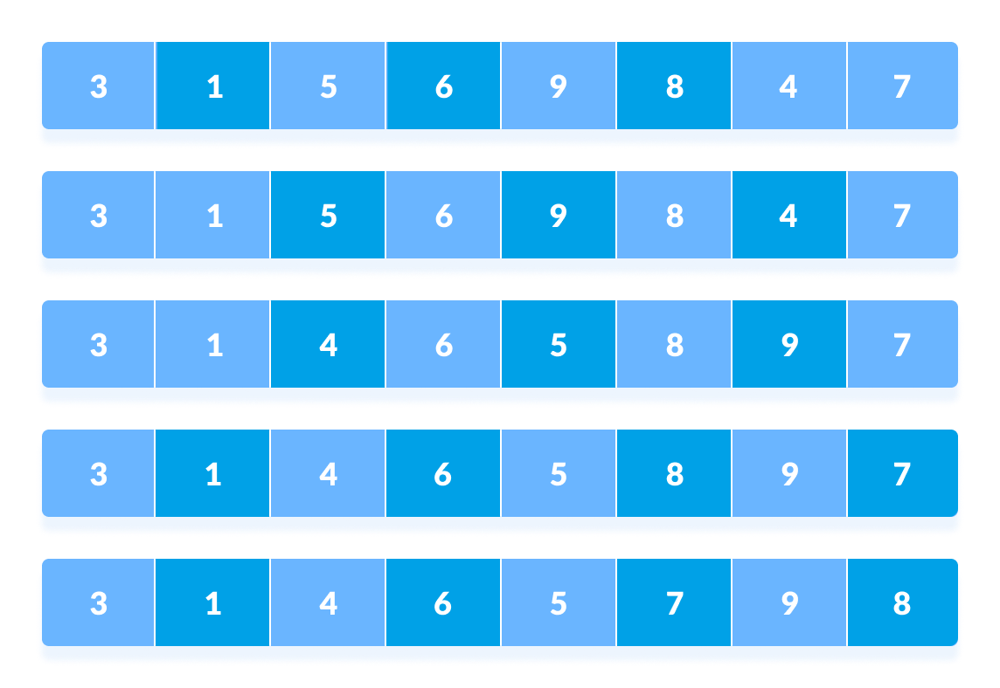

# ** ShellSort **

O **ShellSort**, proposto por Donald Shell em 1959, é uma extensão do algoritmo **InsertionSort**. Ele foi desenvolvido para melhorar a eficiência da ordenação, especialmente para listas grandes, resolvendo alguns problemas do InsertionSort, como:

1. **Movimentações adjacentes custosas**: No InsertionSort, itens são movidos uma posição por vez, o que pode ser ineficiente para listas grandes.
2. **Desempenho insatisfatório em listas desordenadas grandes**: O InsertionSort pode ser lento quando o menor elemento está distante de sua posição final.

O ShellSort utiliza um conceito de **salto (h)** para comparar e trocar elementos que não estão adjacentes, reduzindo o número de movimentações necessárias para ordenar a lista.

<p align="center">
  
</p>

<p align="center">
  
</p>

## **Como o ShellSort Funciona**

1. **Escolha de um salto (`h`)**  
   Inicialmente, define-se um salto (`h`), que é a distância entre os elementos a serem comparados. A sequência de `h` geralmente segue a fórmula de Knuth:  
   \[
   h*s = 3h*{s-1} + 1 \text{, começando com } h_1 = 1
   \]
   Por exemplo, para um vetor de tamanho 10:  
   Sequência de `h`: 1, 4, 13, ...

2. **Ordenação por salto**  
   Os elementos a uma distância `h` são ordenados. O valor de `h` é gradualmente reduzido até que `h = 1`. Nesse ponto, o algoritmo se comporta como o **InsertionSort**, finalizando a ordenação.

3. **Trocas distantes**  
   O método permite trocar elementos distantes entre si, diminuindo significativamente o custo de reorganização, especialmente em listas grandes.

## **Implementação em C**

### Código com Explicações

```c
#include <stdio.h>

// Função para realizar o ShellSort
void shellSort(int array[], int tamanho) {
    int h = 1; // Inicializa o salto

    // Calcula o maior valor de h baseado na sequência de Knuth
    while (h < tamanho / 3) {
        h = 3 * h + 1; // h = 1, 4, 13, ...
    }

    // Reduz o salto até 1
    while (h >= 1) {
        // Ordenação por inserção com salto h
        for (int i = h; i < tamanho; i++) {
            int valorAtual = array[i];
            int j = i;

            // Move elementos maiores que o valor atual para frente
            while (j >= h && array[j - h] > valorAtual) {
                array[j] = array[j - h];
                j -= h;
            }

            array[j] = valorAtual; // Insere o valor na posição correta
        }

        h /= 3; // Reduz o salto
    }
}

// Função para imprimir o array
void imprimeArray(int array[], int tamanho) {
    for (int i = 0; i < tamanho; i++) {
        printf("%d ", array[i]);
    }
    printf("\n");
}

int main() {
    int vetor[] = {29, 10, 14, 37, 14, 3, 89, 6, 25, 50};
    int tamanho = sizeof(vetor) / sizeof(vetor[0]);

    printf("Array original: \n");
    imprimeArray(vetor, tamanho);

    shellSort(vetor, tamanho);

    printf("Array ordenado: \n");
    imprimeArray(vetor, tamanho);

    return 0;
}
```

### **Análise do Código**

1. **Cálculo do salto (`h`)**  
   O maior valor de `h` é determinado antes de começar a ordenação, utilizando a fórmula de Knuth. Isso garante que o processo inicie com trocas mais distantes.

2. **Ordenação por inserção modificada**  
   A ordenação é feita dentro de cada subgrupo formado por `h`. O algoritmo utiliza uma modificação do **InsertionSort** que opera dentro desses subgrupos.

3. **Redução do salto**  
   Após ordenar os elementos com um determinado `h`, o salto é reduzido (`h = h / 3`) e o processo é repetido até `h = 1`.

### **Exemplo de Execução**

Considere o vetor inicial:  
`[29, 10, 14, 37, 14, 3, 89, 6, 25, 50]`

1. **Primeiro salto (`h = 4`)**

   - Comparações e trocas são feitas entre elementos a 4 posições de distância.  
     Resultado intermediário: `[14, 10, 14, 6, 3, 29, 89, 37, 25, 50]`

2. **Reduzindo o salto (`h = 1`)**
   - O vetor é ordenado como no **InsertionSort**, finalizando a ordenação.  
     Resultado final: `[3, 6, 10, 14, 14, 25, 29, 37, 50, 89]`

## **Complexidade do ShellSort**

1. **Melhor caso:** \(O(n \log n)\) (lista quase ordenada).
2. **Pior caso:** Dependente da sequência de `h`. Com a sequência de Knuth, é mais eficiente, mas ainda pode chegar a \(O(n^{2})\) em casos extremos.

### **Quando Usar ShellSort?**

- **Vantagens:**

  - Desempenho superior ao **InsertionSort** para listas grandes.
  - Funciona bem para listas moderadamente grandes e quase ordenadas.

- **Desvantagens:**
  - Não é estável (pode alterar a ordem relativa de elementos iguais).
  - Complexidade de tempo não garantida no pior caso.

Com essa explicação e o exemplo em C, você terá uma base sólida para entender e implementar o ShellSort em seus projetos!
