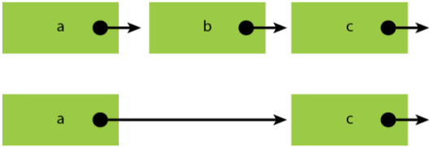
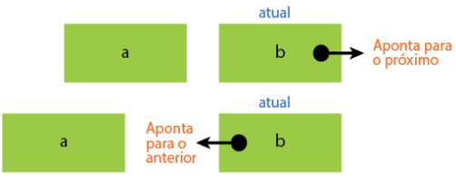
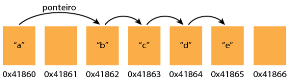
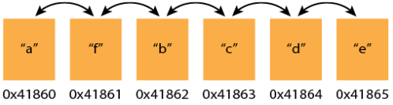
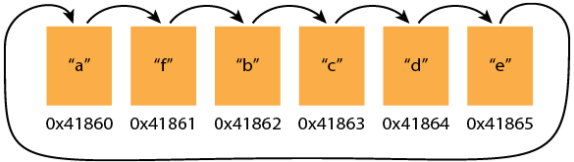

### Listas Encadeadas

#### Introdução

Uma **lista encadeada** é uma estrutura de dados fundamental em ciência da computação. Assim como arrays, ela permite a inserção, remoção, busca e manipulação de elementos. No entanto, diferentemente dos arrays, os elementos de uma lista encadeada não são armazenados em posições consecutivas da memória. Em vez disso, cada elemento, chamado **nó**, contém um ponteiro que indica a localização do próximo nó.

O primeiro nó da lista é conhecido como **cabeça** (_head_), e o último nó geralmente aponta para `NULL`, indicando o fim da lista. Essa abordagem oferece flexibilidade para inserir e remover elementos sem a necessidade de reorganizar os outros itens da lista.

<p align="center">
  
</p>

#### Estrutura de uma Lista Encadeada

Em C, uma lista encadeada é geralmente representada por uma estrutura contendo dois componentes:

1. **Dados**: O valor armazenado no nó.
2. **Ponteiro**: Referência para o próximo nó da lista.

Abaixo está uma representação básica de um nó em C:

```c
#include <stdio.h>
#include <stdlib.h>

// Definição do nó da lista encadeada
typedef struct Node {
    int data;           // Dados armazenados no nó
    struct Node* next;  // Ponteiro para o próximo nó
} Node;
```

#### Operações em Listas Encadeadas

##### 1. **Criação de uma Lista**

Para iniciar uma lista encadeada, criamos um ponteiro para o nó principal (_head_), que inicialmente aponta para `NULL`:

```c
struct Node* head = NULL;
```

##### 2. **Inserção de Elementos**

Existem diferentes formas de inserir elementos em uma lista encadeada. Antes de inserir, é útil utilizar uma função para criar novos nós de maneira eficiente:

```c
// Função para criar um novo nó
Node* criarNo(int data) {
    Node* newNode = (Node*)malloc(sizeof(Node));
    newNode->data = data;
    newNode->next = NULL;
    return newNode;
}
```

- **Inserção no Início**  
   Um novo nó é criado e o ponteiro dele passa a apontar para a cabeça da lista:

  ```c
  void inserirNoInicio(Node** head_ref, int data) {
    Node* newNode = criarNo(data);
    newNode->next = *head_ref;
    *head_ref = newNode;
  }
  ```

- **Inserção no Final**  
   Para adicionar um elemento ao final, percorremos a lista até encontrar o último nó, cujo ponteiro `next` será ajustado:

  ```c
  void inserirNoFinal(Node** head_ref, int data) {
    Node* newNode = criarNo(data);
    if (*head_ref == NULL) {
        *head_ref = newNode;
        return;
    }

    Node* temp = *head_ref;
    while (temp->next != NULL) {
        temp = temp->next;
    }
    temp->next = newNode;
  }
  ```

A função `criarNo` simplifica o código ao encapsular a lógica de criação de um novo nó, evitando redundâncias e facilitando a manutenção.

##### 3. **Exclusão de Elementos**

Para excluir um nó, precisamos ajustar o ponteiro do nó anterior para apontar para o próximo nó, removendo a referência ao nó desejado:

<p align="center">
  
</p>

```c
void excluirNo(Node** head_ref, int key) {
    Node* temp = *head_ref;
    Node* prev = NULL;

    // Se o nó a ser excluído for o primeiro
    if (temp != NULL && temp->data == key) {
        *head_ref = temp->next;
        free(temp);
        return;
    }

    // Busca pelo nó a ser excluído
    while (temp != NULL && temp->data != key) {
        prev = temp;
        temp = temp->next;
    }

    // Se o nó não foi encontrado
    if (temp == NULL) {
        printf("Elemento %d não encontrado na lista.\n", key);
        return;
    }

    prev->next = temp->next;
    free(temp);
}
```

##### 4. **Busca de Elementos**

A busca em uma lista encadeada percorre a lista nó por nó, comparando o valor armazenado no nó atual com o valor alvo. Se encontrado, a função retorna `1` (verdadeiro); caso contrário, retorna `0` (falso).

```c
int buscarNo(struct Node* head, int target) {
    struct Node* current = head;

    while (current != NULL) {
        if (current->data == target) {
            return 1; // Elemento encontrado
        }
        current = current->next; // Avança para o próximo nó
    }
    return 0; // Elemento não encontrado
}
```

Este método é linear, com complexidade de tempo \(O(n)\), sendo adequado para listas encadeadas de tamanho pequeno a moderado.

Se quisermos que o método de busca retorne o próprio **dado encontrado** (ou um ponteiro para o nó contendo o dado), em vez de apenas `1` ou `0`, podemos ajustar o código para retornar um ponteiro para o nó onde o dado foi encontrado. Caso o dado não exista na lista, o método retornará `NULL`. Essa abordagem é mais flexível e informativa.

Podemos substituir o retorno de `1` ou `0` pelo ponteiro para o nó encontrado como segue:

```c
// Função de busca que retorna o nó contendo o dado
Node* buscarNo(Node* head, int target) {
    while (head != NULL) {
        if (head->data == target) {
            return head; // Retorna o ponteiro para o nó encontrado
        }
        head = head->next;
    }
    return NULL; // Retorna NULL se o elemento não foi encontrado
}
```

Assim além de saber se o dado está presente, podemos acessar outras informações do nó encontrado (por exemplo, o ponteiro para o próximo nó ou qualquer dado adicional armazenado no nó). Essa abordagem é mais genérica e amplamente usada em estruturas de dados.

##### 5. **Percorrer a Lista**

Podemos percorrer a lista encadeada para exibir todos os seus elementos:

```c
void imprimirLista(Node* node) {
    while (node != NULL) {
        printf("%d", node->data);
        node = node->next;
        if (node != NULL) { // Adiciona "->" apenas se não for o último elemento evitando exibir NULL
            printf(" -> ");
        }
    }
    printf("\n");
}
```

#### 6. **Inversão de uma Lista Encadeada**

A inversão de uma lista encadeada é uma operação que altera a direção dos ponteiros de cada nó, transformando o último elemento na nova cabeça da lista. O processo envolve percorrer a lista com um laço, utilizando três variáveis: uma para o nó atual, outra para o nó anterior e uma terceira para armazenar temporariamente o próximo nó. Durante o percurso, cada ponteiro é ajustado para apontar para o nó anterior, e ao final do laço, a cabeça da lista é configurada para o último nó processado. Esse algoritmo é eficiente, pois percorre a lista apenas uma vez, com complexidade O(n). A técnica é amplamente utilizada em algoritmos que manipulam estruturas dinâmicas de dados.

<p align="center">
  
</p>

```c
// Função para inverter a lista encadeada
Node* inverterLista(Node* head) {
    Node* atual = head;  // Nó atual
    Node* anterior = NULL; // Nó anterior
    Node* proximo = NULL;  // Próximo nó temporário

    while (atual != NULL) {
        proximo = atual->next;   // Armazena o próximo nó
        atual->next = anterior;  // Inverte o ponteiro
        anterior = atual;        // Avança o nó anterior
        atual = proximo;         // Avança o nó atual
    }
    return anterior; // Novo cabeçalho da lista
}
```

#### Tipos de Listas Encadeadas

##### 1. **Lista Encadeada Simples**

Cada nó aponta apenas para o próximo nó. Operações de iteração ocorrem sempre do início para o fim.

<p align="center">
  
</p>

##### 2. **Lista Duplamente Encadeada**

Cada nó contém dois ponteiros: um para o próximo nó e outro para o nó anterior. Isso permite a navegação em ambas as direções.

<p align="center">
  
</p>

```c
struct Node {
    int data;
    struct Node* next;  // Ponteiro para o próximo nó
    struct Node* prev;  // Ponteiro para o nó anterior
};
```

##### 3. **Lista Circular**

Em uma lista circular, o último nó aponta para o primeiro nó, formando um ciclo.

<p align="center">
  
</p>

```c
void criarCircular(struct Node* head) {
    struct Node* temp = head;
    while (temp->next != NULL) {
        temp = temp->next;
    }
    temp->next = head;  // Último nó aponta para a cabeça
}
```

#### Complexidade das Operações

| Operação          | Lista Encadeada Simples | Array        |
| ----------------- | ----------------------- | ------------ |
| Inserir no início | O(1)                    | O(n)         |
| Inserir no final  | O(n)                    | O(1) ou O(n) |
| Remover no início | O(1)                    | O(n)         |
| Remover no final  | O(n)                    | O(1) ou O(n) |
| Acessar um dado   | O(n)                    | O(1)         |

### Vocabulário

**Acesso Aleatório**: Torna possível o acesso aos dados aleatoriamente em tempo constante.

**Cabeça**: Primeiro nó de uma lista encadeada.

**Ciclo**: Quando algum nó de uma lista encadeada aponta para o nó anterior.

**Lista Duplamente Encadeada**: Um tipo de lista encadeada no qual cada nó contém dois ponteiros, um apontando para o nó seguinte e o outro apontando para o nó anterior, o que permite percorrê-la nas duas direções.

**Lista Encadeada**: Uma implementação do tipo de dados abstrato lista.

**Lista Encadeada Circular**: Um tipo de lista encadeada no qual o último nó aponta para o primeiro, o que nos permite ir do último ao primeiro elemento da lista.

**Lista Encadeada Simples**: Um tipo de lista encadeada com ponteiros que apontam apenas para o elemento seguinte.

**Nó**: Parte de uma estrutura de dados que contém trechos de dados e pode se conectar com outros trechos de dados.

**Ponteiro**: Dados de cada nó que contêm a localização do próximo nó de uma lista encadeada.

### Conclusão

Listas encadeadas são uma ferramenta poderosa para situações que exigem inserções e remoções frequentes. Apesar de suas desvantagens, como maior uso de memória e acesso sequencial, sua flexibilidade as torna indispensáveis em várias aplicações computacionais.

#### Exemplo de Implementação em C

```c
#include <stdio.h>
#include <stdlib.h>

// Definição do nó da lista encadeada
typedef struct Node {
    int data;           // Dados armazenados no nó
    struct Node* next;  // Ponteiro para o próximo nó
} Node;

// Função para criar um novo nó
Node* criarNo(int data) {
    Node* newNode = (Node*)malloc(sizeof(Node));
    if (newNode == NULL) {
        printf("Erro ao alocar memória!\n");
        exit(1);
    }
    newNode->data = data;
    newNode->next = NULL;
    return newNode;
}

// Função para inserir um nó no início da lista
void inserirNoInicio(Node** head_ref, int data) {
    Node* newNode = criarNo(data);
    newNode->next = *head_ref;
    *head_ref = newNode;
}

// Função para inserir um nó no final da lista
void inserirNoFinal(Node** head_ref, int data) {
    Node* newNode = criarNo(data);
    if (*head_ref == NULL) {
        *head_ref = newNode;
        return;
    }

    Node* temp = *head_ref;
    while (temp->next != NULL) {
        temp = temp->next;
    }
    temp->next = newNode;
}

// Função para excluir um nó com base no valor
void excluirNo(Node** head_ref, int key) {
    Node* temp = *head_ref;
    Node* prev = NULL;

    // Se o nó a ser excluído for o primeiro
    if (temp != NULL && temp->data == key) {
        *head_ref = temp->next;
        free(temp);
        return;
    }

    // Busca pelo nó a ser excluído
    while (temp != NULL && temp->data != key) {
        prev = temp;
        temp = temp->next;
    }

    // Se o nó não foi encontrado
    if (temp == NULL) {
        printf("Elemento %d não encontrado na lista.\n", key);
        return;
    }

    prev->next = temp->next;
    free(temp);
}

// Função para buscar um elemento na lista
Node* buscarNo(Node* head, int target) {
    while (head != NULL) {
        if (head->data == target) {
            return head; // Retorna o ponteiro para o nó encontrado
        }
        head = head->next;
    }
    return NULL; // Retorna NULL se o elemento não foi encontrado
}

// Função para imprimir a lista
void imprimirLista(Node* node) {
    while (node != NULL) {
        printf("%d", node->data);
        node = node->next;
        if (node != NULL) { // Adiciona "->" apenas se não for o último elemento
            printf(" -> ");
        }
    }
    printf("\n");
}

// Função para inverter a lista encadeada
Node* inverterLista(Node* head) {
    Node* current = head;
    Node* previous = NULL;
    Node* next = NULL;

    while (current != NULL) {
        next = current->next;
        current->next = previous;
        previous = current;
        current = next;
    }
    return previous;
}

int main() {
    Node* head = NULL;
    int escolha, valor;

    do {
        printf("\nMenu de Operações:\n");
        printf("1. Inserir no início\n");
        printf("2. Inserir no final\n");
        printf("3. Excluir elemento\n");
        printf("4. Buscar elemento\n");
        printf("5. Imprimir lista\n");
        printf("6. Inverter lista\n");
        printf("0. Sair\n");
        printf("Escolha uma opção: ");
        scanf("%d", &escolha);

        switch (escolha) {
            case 1:
                printf("Digite o valor a ser inserido no início: ");
                scanf("%d", &valor);
                inserirNoInicio(&head, valor);
                break;

            case 2:
                printf("Digite o valor a ser inserido no final: ");
                scanf("%d", &valor);
                inserirNoFinal(&head, valor);
                break;

            case 3:
                printf("Digite o valor a ser excluído: ");
                scanf("%d", &valor);
                excluirNo(&head, valor);
                break;

            case 4:
                printf("Digite o valor a ser buscado: ");
                scanf("%d", &valor);
                Node* resultado = buscarNo(head, valor);
                if (resultado != NULL) {
                    printf("Elemento %d encontrado.\n", resultado->data);
                } else {
                    printf("Elemento %d não encontrado.\n", valor);
                }
                break;

            case 5:
                printf("Lista: ");
                imprimirLista(head);
                break;

            case 6:
                head = inverterLista(head);
                printf("Lista invertida com sucesso!\n");
                break;

            case 0:
                printf("Encerrando o programa.\n");
                break;

            default:
                printf("Opção inválida!\n");
        }
    } while (escolha != 0);

    // Liberar memória ao final
    while (head != NULL) {
        Node* temp = head;
        head = head->next;
        free(temp);
    }

    return 0;
}
```
